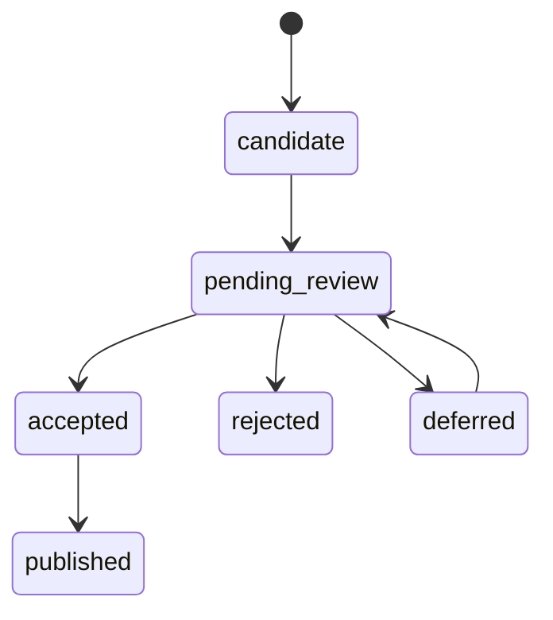

# 知识级冲突发现与人工处理设计

## 1. 背景

知识库已经具备文档上传、解析、清洗、版本替换、向量索引和图谱抽取能力，但“文档不重复”不代表“知识不冲突”。同一产品的不同文档可能给出不同型号、规格、版本或有效时间。新知识不能未经审核直接覆盖线上知识。

## 2. 目标

- 将抽取结果先保存为有证据、可追溯的候选知识。
- 使用确定性业务规则完成实体链接、数据标准化和冲突分类。
- 为 Product 与 Specification 提供可演示、可人工裁决的纵向 MVP。
- 旧知识在审核和发布完成前继续有效。

## 3. 非目标

- 不替代现有文档级重复检测。
- 不把所有旧图谱数据自动迁移为经过审核的知识。
- 不实现复杂本体编辑器、多人审批、自动来源优先级或模型私有推理存储。
- MVP 不声称已经把审核结果同步到 Neo4j 和图 Milvus；图发布适配器是后续工作。

## 4. 已完成的文档级冲突

文档级能力已经覆盖 SHA-256 完全重复、同名不同内容、两阶段服务端复核、并发替换、inactive 候选、原子版本切换、旧向量异步清理和 active 检索过滤。这些能力解决“文件是否重复或替换”，不等同于知识级冲突检测。

## 5. 知识级冲突范围

- 实体链接不确定：同名产品、别名或相似名称无法唯一归属。
- 属性值冲突：同一上下文中的单值属性出现不同值。
- 关系冲突：同一关系槽位出现互斥目标（设计范围，MVP 尚未实现关系发布）。
- 单值/多值约束：最大并发是单值，支持操作系统是多值。
- 单位/格式冲突：例如 1000 g 与 1 kg 应先标准化再比较。
- 版本/时间冲突：不同产品版本或不重叠有效期是更新。
- 来源冲突：来源优先级由甲方确认，不在代码中擅自决定。
- 信息缺失/补全：旧值为空或多值集合新增有效成员。

## 6. 总体流程


MVP 中审核结果与正式 assertion 真实落 PostgreSQL，但 Neo4j/Milvus 图投影标记为 `pending`，不会被描述为已经发布。

## 7. 实体链接

保守优先级：

1. 精确业务 ID；
2. 产品型号；
3. 品牌 + 型号；
4. 标准化产品名称；
5. 已确认别名；
6. 字符串相似度只召回候选；
7. 大模型只能辅助解释，不能自动合并；
8. 无唯一确定性命中时进入人工确认。

结果为 `linked`、`new_entity`、`ambiguous` 或 `rejected`。MVP 复用 `knowledge_graph_entities` 作为可链接实体目录，不改变现有图构建流程。

## 8. 数据标准化

- 文本：Unicode NFKC、首尾空白和连续空格规范化。
- 整数：去千位分隔符后严格解析。
- 枚举：大小写不敏感匹配，保存规则中的标准写法。
- 多值：逐项标准化、去重、稳定排序。
- 重量：统一为 kg；当前支持 mg、g、kg、lb。
- 日期：ISO 日期/时间。

标准化值用于比较，原始值始终保留用于审核。

## 9. 冲突分类

- `DUPLICATE`：标准化后值相同。
- `COMPLETION`：正式值为空，或多值属性出现新成员。
- `UPDATE`：产品版本不同，或有效时间范围不重叠。
- `CONFLICT`：同实体、同版本、有效时间重叠的单值属性不同。
- `LINK_AMBIGUOUS`：无法通过确定性规则唯一链接实体。
- `INVALID`：类型、单位、枚举或业务规则无效。

## 10. 冲突判断规则

判断顺序为：证据有效性 → 实体链接 → 业务规则校验 → 单位/格式标准化 → 版本和时间上下文 → 单值/多值比较。不能只因原始文本不同就判定冲突。业务规则样例见 `knowledge-conflict-rule-matrix.csv`。

## 11. 人工处理方式

允许保留旧值、使用新值、合并、按版本分别保留、标记为补全、关联已有实体、创建新实体、暂缓或拒绝新候选。页面不默认选择“使用新值”。审核前旧知识继续有效，候选不进入正式 GraphRAG。审核使用 `version` 乐观锁；重复提交相同处理结果幂等。

## 12. 数据模型

### KnowledgeAssertion

保存实体、谓词、原始值与标准化值、类型和单位、有效期、产品版本、`file_id/chunk_id/evidence`、正文版本、内容哈希、抽取方法、置信度、状态与时间。

硬约束：

- evidence 必须是绑定 chunk 的原文子串；
- chunk 必须属于 file，file 必须属于当前知识库；
- 来源文档必须 active 且 indexed；
- 正文版本和内容哈希由服务端读取。

### EntityLinkCandidate

保存候选名称、标准名、目标实体、命中规则、相似度、别名、状态与处理人。

### KnowledgeConflict

保存新旧 assertion、分类、标准化比较值、检测规则、严重度、审核状态、处理结果、处理人、版本和图发布状态。

## 13. API

- `GET /api/knowledge/databases/{kb_id}/conflicts`
- `GET /api/knowledge/databases/{kb_id}/conflicts/{conflict_id}`
- `POST /api/knowledge/databases/{kb_id}/assertions/evaluate`
- `POST /api/knowledge/databases/{kb_id}/conflicts/{conflict_id}/resolve`
- `POST /api/knowledge/databases/{kb_id}/conflicts/batch-resolve`
- `GET /api/knowledge/databases/{kb_id}/entity-link-candidates`

跨知识库资源返回 404，避免暴露资源存在性。

## 14. 页面设计

```text
+------------------------------------------------------------------+
| 知识冲突审核                     [状态: 待处理 v] [刷新]          |
+--------------------+--------------------+-------------------------+
| 当前知识           | 新候选知识         | 系统判断                |
| 产品/字段/旧值     | 新值/抽取方式       | 分类、规则、标准化值      |
| 来源文档/版本      | 来源文档/正文版本   | 实体/版本/时间是否相同    |
| 原文证据           | 原文证据            |                         |
+--------------------+--------------------+-------------------------+
| [请选择处理结果 v] [已有实体 ID] [处理理由] [确认处理]           |
+------------------------------------------------------------------+
```

页面展示图发布等待状态，不把“审核已保存”误写成“GraphRAG 已同步”。

## 15. 权限

- `can_view`：列表、详情和实体链接候选。
- `can_manage`：提交候选、批量/单条裁决和发布请求。
- 只读用户写操作返回 403；跨知识库资源返回 404。

## 16. 状态流转



冲突记录使用 `pending/resolved/ignored/deferred`。MVP 接受后 assertion 为 `published`，图投影状态为 `pending`。

## 17. 与文档版本的关系

每条 assertion 绑定 `file_id`、`chunk_id`、`cleaning_version` 和 `content_hash`。旧文档版本及旧 chunk 仍保留，因此历史证据可审计。新文档版本不会静默覆盖旧 assertion。

## 18. 测试与验收

- 分类：单值重复、多值补全、同版本冲突、跨版本/时间更新、单位换算、非法枚举和实体歧义。
- 证据：chunk/file/kb 归属与原文子串。
- 审核：乐观锁、重复确认幂等、人工结果保护。
- 权限：can_view 读取、can_manage 写入、跨知识库 404。
- 集成：创建正式知识 → 新候选 → 冲突 → 审核 → 正式 assertion 更新 → 清理。

四个演示案例：

| 场景       | 旧值               | 新值            | 上下文       | 结果       |
| ---------- | ------------------ | --------------- | ------------ | ---------- |
| A 重复     | 最大并发=100       | 100             | 同产品同版本 | DUPLICATE  |
| B 补全     | 支持系统=[Windows] | Linux           | 多值属性     | COMPLETION |
| C 版本更新 | V1 最大并发=100    | V2 最大并发=200 | 版本不同     | UPDATE     |
| D 真冲突   | 最大并发=100       | 200             | 同产品同版本 | CONFLICT   |

## 19. 当前限制

- 现有 LLM 图抽取仍会直接写旧图谱表，尚未全部改造为候选 assertion。
- 审核后的 assertion 是正式 PostgreSQL 知识；Neo4j 和图 Milvus 发布适配器尚未接入。
- MVP 只覆盖 Product/Specification 属性，不覆盖完整关系约束、本体继承和来源可信度计算。
- CSV 是甲方确认材料；运行时暂使用同等的代码内默认规则，尚无规则管理后台。

## 20. 后续扩展

### 图发布

增加 outbox/幂等发布任务，将审核通过的 assertion 投影为 Neo4j 属性/关系和图向量；失败可重试且不丢审核结果。

### 文档语义近重复

```text
SHA-256 不同
→ 清洗正文规范化
→ SimHash/MinHash 候选召回
→ Embedding 相似度复核
→ 高相似文档提示
→ 用户选择继续或取消
```

该能力只提示、不自动拒绝；展示相似文档与重复片段，阈值配置化，并用甲方测试数据校准。

### 业务规则管理

将甲方确认的 CSV 导入版本化规则表，增加生效时间、规则版本、审批人和回滚。来源优先级、数值容差和自动补全白名单必须由甲方确认。
